# Embedding / Reranker 推理框架耗时对比

对比 Embedding 模型和 Reranker 模型在不同推理框架下的延迟与吞吐量，为生产选型提供数据支撑。

## 硬件环境

- GPU: NVIDIA RTX 5090 (32GB GDDR7, Blackwell 架构)
- 部署方式:
  - Transformers / vLLM: `uv pip install` 本地安装
  - TEI: Docker 容器 (无成熟 pip 包)
- 同一时间只运行一个模型服务，避免 GPU 资源争抢

### 软件版本

| 组件 | 版本 | 备注 |
|------|------|------|
| TEI (Docker) | `ghcr.io/huggingface/text-embeddings-inference:120-1.9` | experimental，支持 RTX 5090 (sm_120) |
| vLLM | `0.20.1` | 本地安装，`runner="pooling"` 模式 |

## 模型清单

| 类型 | 模型 | 参数量 | ModelScope 路径 |
|------|------|--------|-----------------|
| Embedding | Qwen3-Embedding-0.6B | 0.6B | `Qwen/Qwen3-Embedding-0.6B` |
| Embedding | Qwen3-Embedding-4B | 4B | `Qwen/Qwen3-Embedding-4B` |
| Embedding | bge-m3 | 0.6B | `BAAI/bge-m3` |
| Reranker | Qwen3-Reranker-0.6B | 0.6B | `Qwen/Qwen3-Reranker-0.6B` |
| Reranker | Qwen3-Reranker-4B | 4B | `Qwen/Qwen3-Reranker-4B` |
| Reranker | bge-reranker-v2-m3 | 0.6B | `BAAI/bge-reranker-v2-m3` |

## 推理框架

| 框架 | Embedding | Reranker | 部署方式 |
|------|-----------|----------|---------|
| Transformers | 本地推理 | 本地推理 | 基线参考 |
| TEI | `/embed` | `/rerank` | Docker 容器 |
| vLLM | `LLM.embed()` | `LLM.score()` | 本地安装 |

注意事项:
- vLLM v0.17.0+ 正式支持 RTX 5090 (sm_120)，自动利用 FP8 Tensor Cores
- vLLM 通过 `uv pip install vllm` 本地安装，使用 `runner="pooling"` 模式
- TEI 通过 Docker 部署: `ghcr.io/huggingface/text-embeddings-inference:latest`
- Qwen3-Reranker 在 vLLM 中需要传入 `chat_template` 参数

## 测试方法

### 延迟测试 (Batch Size 维度)

| 维度 | 取值 |
|------|------|
| batch size | 1, 2, 3, 4, 8, 12, 32 |
| 文本长度 | short (~32 tokens), medium (~256 tokens), long (~1024 tokens) |
| 指标 | avg, P95 (ms), throughput (req/s) |
| 轮数 | 20 轮 (3 warmup + 17 measure)，trimmed mean |

### 并发测试 (Concurrency 维度)

| 维度 | 取值 |
|------|------|
| 并发度 | 1, 3, 5, 10, 20, 32 |
| 每请求 batch size | 固定 1 |
| 文本长度 | short, medium, long |
| 指标 | QPS, wall_avg, wall_p95, req_avg, req_p95 |
| 轮数 | 10 轮 (3 warmup + 7 measure)，trimmed mean |

### Reranker 测试

| 维度 | 取值 |
|------|------|
| batch size | 固定 6 文档 |
| 指标 | avg, P95 (ms) |

## 快速开始

### 1. 环境准备

```bash
# 克隆项目
git clone <repo-url> && cd embedding_bench

# 安装依赖 (需要 uv)
uv sync

# 下载模型 (ModelScope)
# 确保模型已下载到本地 ModelScope 缓存目录
# 默认路径: ~/.cache/modelscope/hub/

# 生成测试语料
uv run python data/generate_corpus.py
```

### 2. 启动推理服务

#### TEI (Docker)

```bash
# Embedding 模型 (以 bge-m3 为例)
docker run --gpus all -p 8080:80 \
    -v ~/.cache/modelscope/hub/BAAI/bge-m3:/data \
    --name tei-bge-m3 --rm -d \
    ghcr.io/huggingface/text-embeddings-inference:120-1.9 \
    --model-id /data

# Reranker 模型 (以 bge-reranker-v2-m3 为例)
docker run --gpus all -p 8081:80 \
    -v ~/.cache/modelscope/hub/BAAI/bge-reranker-v2-m3:/data \
    --name tei-bge-reranker --rm -d \
    ghcr.io/huggingface/text-embeddings-inference:120-1.9 \
    --model-id /data

# 或使用项目脚本 (含健康检查)
./scripts/start_tei.sh ~/.cache/modelscope/hub/BAAI/bge-m3 8080

# 停止服务
./scripts/stop_tei.sh 8080
```

#### vLLM (本地)

```bash
# Embedding 模型
uv run vllm serve Qwen/Qwen3-Embedding-0.6B \
    --host 0.0.0.0 --port 8080 \
    --runner pooling \
    --gpu-memory-utilization 0.3

# Reranker 模型
uv run vllm serve Qwen/Qwen3-Reranker-0.6B \
    --host 0.0.0.0 --port 8080 \
    --runner pooling \
    --gpu-memory-utilization 0.3
```

> vLLM 和 Transformers 框架的测试由 `main.py` 自动加载模型，无需手动启动服务。

### 3. API 调用示例

启动服务后，可通过 HTTP 接口调用：

```bash
# Embedding - 获取文本向量
curl -X POST http://localhost:8000/v1/embeddings \
  -H "Content-Type: application/json" \
  -d '{"input": "What is machine learning?", "model": "Qwen/Qwen3-Embedding-4B", "encoding_format": "float"}'

# Reranker - 对文档重排序
curl http://localhost:8000/v1/rerank \
  -H "Content-Type: application/json" \
  -d '{
    "model": "Qwen/Qwen3-Reranker-4B",
    "query": "什么是通义千问？",
    "documents": [
      "北京是中国的首都，拥有悠久的历史。",
      "通义千问是阿里云推出的一款超大规模语言模型。",
      "我今天中午吃了一碗牛肉面，味道非常不错。"
    ]
  }'
```

### 4. 运行测试

```bash
# 全量测试 (所有模型 x 所有框架)
uv run python main.py

# 只测试指定模型
uv run python main.py --models bge-m3 Qwen3-Embedding-0.6B

# 只测试指定框架
uv run python main.py --frameworks transformers vllm

# 单模型单框架快速验证
uv run python main.py --models bge-m3 --frameworks transformers --test-type latency

# 指定 TEI 端口 (避免冲突)
uv run python main.py --tei-port 9000

# 自定义输出目录
uv run python main.py --output-dir my_results
```

### 3. 单服务快速测试

```bash
# 启动服务后，直接测试单个端点
uv run python scripts/test_server.py --base-url http://localhost:8080 --backend tei --type embedding

# 只跑并发测试
uv run python scripts/test_server.py --base-url http://localhost:8000 --backend vllm --type embedding --mode concurrency
```

### 4. 生成报告

```bash
uv run python scripts/generate_report.py
```

## CLI 参数

```
uv run python main.py [-h] [--config CONFIG] [--corpus CORPUS]
                      [--models MODELS [MODELS ...]]
                      [--frameworks {transformers,vllm,tei} [...]]
                      [--test-type {latency,throughput,all}]
                      [--output-dir OUTPUT_DIR]
                      [--tei-port TEI_PORT]
                      [--generate-corpus]

options:
  --config CONFIG           模型配置文件路径 (默认: configs/models.yaml)
  --corpus CORPUS           测试语料路径 (默认: data/corpus.jsonl)
  --models MODELS [MODELS ...]
                            指定测试模型 (默认: 全部)
  --frameworks {transformers,vllm,tei} [...]
                            指定推理框架 (默认: 全部)
  --test-type {latency,throughput,all}
                            测试类型 (默认: all)
  --output-dir OUTPUT_DIR   结果输出目录 (默认: results)
  --tei-port TEI_PORT       TEI 容器起始端口 (默认: 8080)
  --generate-corpus         生成测试语料后退出
```

## 项目结构

```
embedding_bench/
├── README.md
├── PLAN.md                       # 详细方案设计文档
├── pyproject.toml                # Python 依赖
├── configs/
│   └── models.yaml               # 模型配置 + 测试参数
├── data/
│   ├── generate_corpus.py        # 测试语料生成脚本
│   └── corpus.jsonl              # 生成的测试语料
├── scripts/
│   ├── start_tei.sh              # TEI Docker 启动脚本 (含健康检查)
│   ├── stop_tei.sh               # TEI Docker 停止脚本
│   ├── test_server.py            # 单服务基准测试 (batch + concurrency)
│   └── generate_report.py        # 解析数据 + 生成图表 + Markdown 报告
├── bench/
│   ├── __init__.py
│   ├── workload.py               # 数据加载 & 批处理
│   ├── metrics.py                # 延迟/吞吐指标 (P50/P95/P99)
│   ├── gpu_monitor.py            # GPU 显存 & 利用率监控
│   ├── transformers_runner.py    # Transformers 基线推理
│   ├── vllm_runner.py            # vLLM 程序化 API 推理
│   ├── client.py                 # TEI HTTP 异步客户端
│   └── reporter.py               # CSV + 图表 + 汇总表生成
├── main.py                       # CLI 入口
└── results/
    ├── bench_data.txt            # 原始测试输出
    ├── report.md                 # 完整测试报告 (含数据明细)
    └── figures/                  # 图表
        ├── Qwen3-Embedding-0.6B_tei_vs_vllm.png
        ├── Qwen3-Embedding-0.6B_p95.png
        ├── Qwen3-Embedding-0.6B_throughput.png
        ├── Qwen3-Embedding-0.6B_concurrency_qps.png
        ├── Qwen3-Embedding-0.6B_concurrency_latency.png
        ├── Qwen3-Embedding-4B_tei_vs_vllm.png
        ├── Qwen3-Embedding-4B_p95.png
        ├── Qwen3-Embedding-4B_throughput.png
        ├── all_tei_models.png
        ├── all_vllm_models.png
        ├── speedup_heatmap.png
        └── reranker_comparison.png
```

## 测试数据

多语言混合语料 (中/英)，内置于项目中:

- **短文本**: 128 条，~32 tokens (标题 / 查询)
- **中等文本**: 128 条，~256 tokens (段落)
- **长文本**: 64 条，~1024 tokens (文档片段)
- **Reranker 专用**: 64 组 query-document pairs (1 query + 6 docs)

使用 `data/generate_corpus.py` 可重新生成。

---

## 测试结果

### 一、Embedding 模型性能对比（Batch Size 维度）

#### Qwen3-Embedding-0.6B

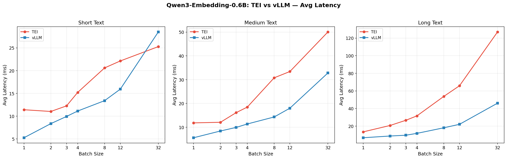

| 场景 | TEI Avg (ms) | vLLM Avg (ms) | vLLM 提速 | TEI P95 (ms) | vLLM P95 (ms) |
|------|:---:|:---:|:---:|:---:|:---:|
| short bs=1 | 11.42 | 5.27 | **2.17x** | 12.78 | 6.07 |
| short bs=32 | 25.28 | 28.50 | **0.89x** | 32.27 | 31.40 |
| medium bs=1 | 11.84 | 5.59 | **2.12x** | 13.03 | 6.60 |
| medium bs=32 | 50.05 | 32.82 | **1.52x** | 53.34 | 34.39 |
| long bs=1 | 13.46 | 6.78 | **1.99x** | 14.26 | 7.23 |
| long bs=32 | 126.97 | 46.07 | **2.76x** | 131.36 | 48.66 |

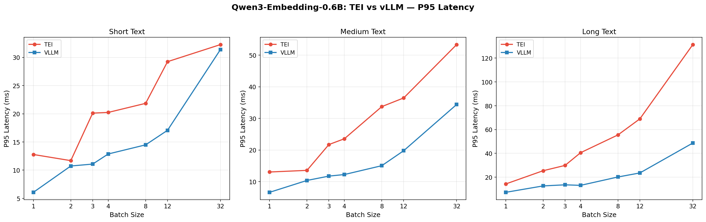

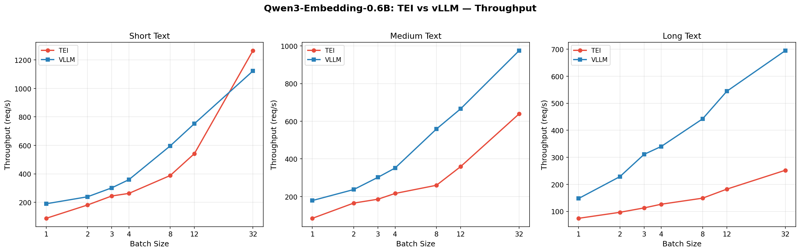

#### Qwen3-Embedding-4B

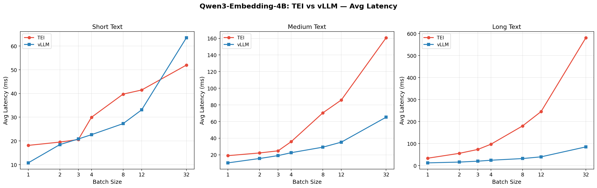

| 场景 | TEI Avg (ms) | vLLM Avg (ms) | vLLM 提速 | TEI P95 (ms) | vLLM P95 (ms) |
|------|:---:|:---:|:---:|:---:|:---:|
| short bs=1 | 18.13 | 10.76 | **1.68x** | 18.64 | 11.56 |
| short bs=32 | 51.97 | 63.48 | **0.82x** | 65.02 | 65.91 |
| medium bs=1 | 18.94 | 10.27 | **1.84x** | 19.39 | 11.76 |
| medium bs=32 | 160.70 | 65.21 | **2.46x** | 165.79 | 66.26 |
| long bs=1 | 33.25 | 12.08 | **2.75x** | 34.09 | 12.82 |
| long bs=32 | 581.13 | 84.79 | **6.85x** | 587.23 | 86.59 |

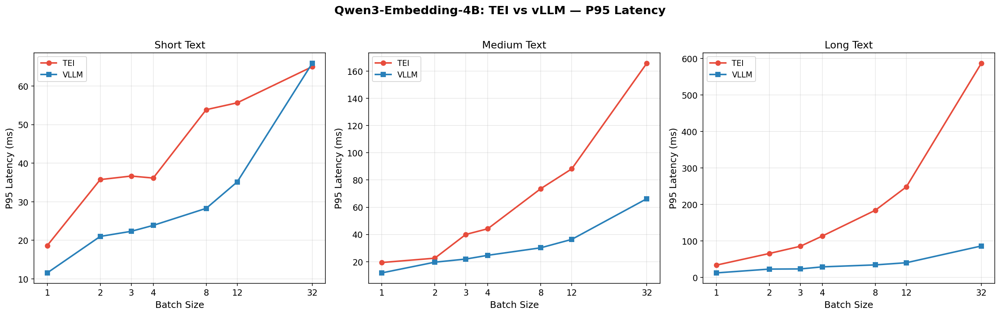

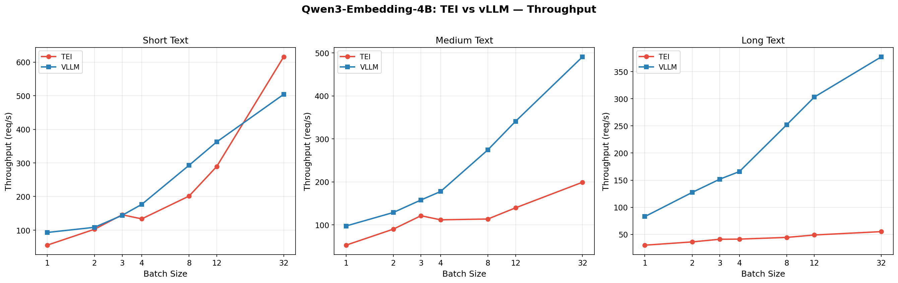

#### TEI 框架 — 所有 Embedding 模型横向对比

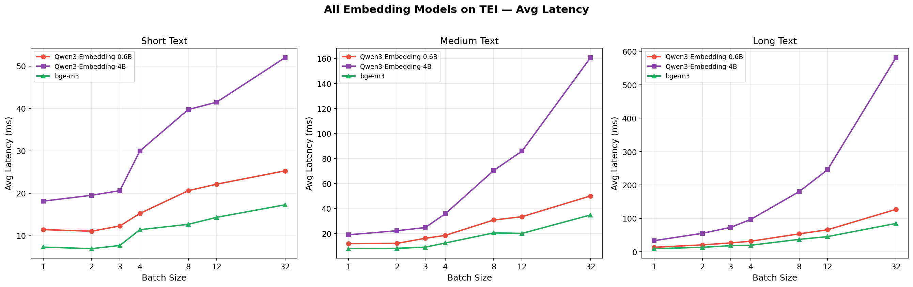

| 模型 | Batch=1 Avg | Batch=32 Avg (short) | Batch=32 Avg (long) | 维度 |
|------|:---:|:---:|:---:|:---:|
| Qwen3-Embedding-0.6B | 11.42 | 25.28 | 126.97 | 1024 |
| Qwen3-Embedding-4B | 18.13 | 51.97 | 581.13 | 2560 |
| bge-m3 | 7.29 | 17.27 | 84.81 | 1024 |

#### vLLM 框架 — 所有 Embedding 模型横向对比

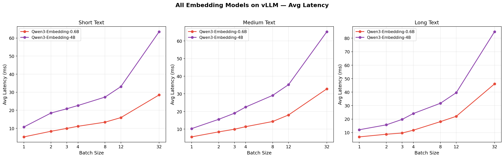

| 模型 | Batch=1 Avg | Batch=32 Avg (short) | Batch=32 Avg (long) | 维度 |
|------|:---:|:---:|:---:|:---:|
| Qwen3-Embedding-0.6B | 5.27 | 28.50 | 46.07 | 1024 |
| Qwen3-Embedding-4B | 10.76 | 63.48 | 84.79 | 2560 |

#### vLLM 相对 TEI 加速比 (Batch Size)

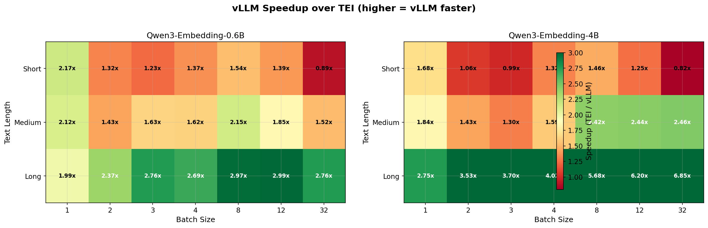

### 二、Embedding 模型并发性能对比

> 每个并发请求 batch=1，模拟多客户端同时访问场景。

#### Qwen3-Embedding-0.6B — 并发 QPS 对比

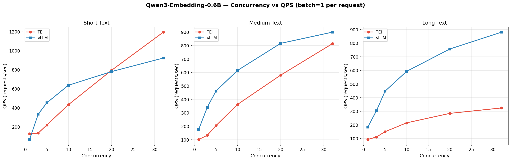

| 并发度 | TEI QPS (short) | vLLM QPS (short) | TEI QPS (medium) | vLLM QPS (medium) | TEI QPS (long) | vLLM QPS (long) |
|:------:|:---:|:---:|:---:|:---:|:---:|:---:|
| 1 | 127 | 67 | 102 | 176 | 93 | 184 |
| 3 | 134 | 333 | 133 | 341 | 111 | 303 |
| 5 | 220 | 453 | 205 | 462 | 150 | 447 |
| 10 | 433 | 637 | 362 | 615 | 215 | 593 |
| 20 | 795 | 781 | 580 | 816 | 284 | 757 |
| 32 | 1196 | 924 | 814 | 899 | 324 | 880 |

#### Qwen3-Embedding-0.6B — 并发下单请求延迟

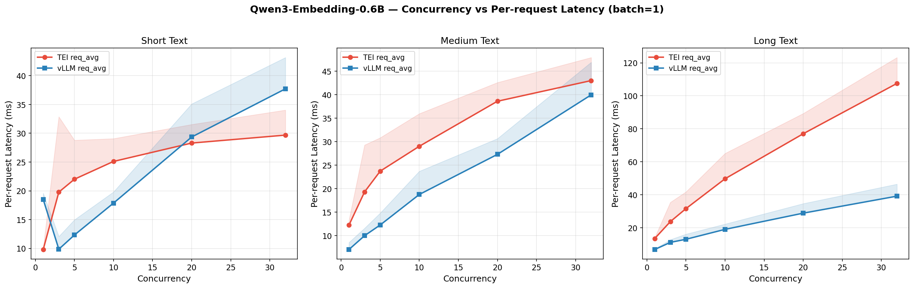

| 并发度 | TEI req_avg (short) | vLLM req_avg (short) | TEI req_p95 (short) | vLLM req_p95 (short) |
|:------:|:---:|:---:|:---:|:---:|
| 1 | 9.8 ms | 18.5 ms | 10.0 ms | 19.6 ms |
| 3 | 19.8 ms | 9.9 ms | 32.9 ms | 12.1 ms |
| 5 | 22.0 ms | 12.3 ms | 28.8 ms | 15.0 ms |
| 10 | 25.1 ms | 17.9 ms | 29.1 ms | 19.8 ms |
| 20 | 28.3 ms | 29.4 ms | 31.5 ms | 35.1 ms |
| 32 | 29.7 ms | 37.7 ms | 34.0 ms | 43.2 ms |

#### 并发测试发现

- **高并发 (cc=32, short)**: TEI QPS (1196) 超过 vLLM (924)，TEI 在高并发短文本下吞吐更优
- **TEI 延迟劣化**: cc=1→32 时单请求延迟从 9.8ms 增至 29.7ms（3.0x）
- **vLLM 延迟劣化**: cc=1→32 时单请求延迟从 18.5ms 增至 37.7ms（2.0x）
- **长文本高并发 (cc=32, long)**: vLLM QPS (880) vs TEI QPS (324)，vLLM 是 TEI 的 2.7x

### 三、Reranker 模型性能对比

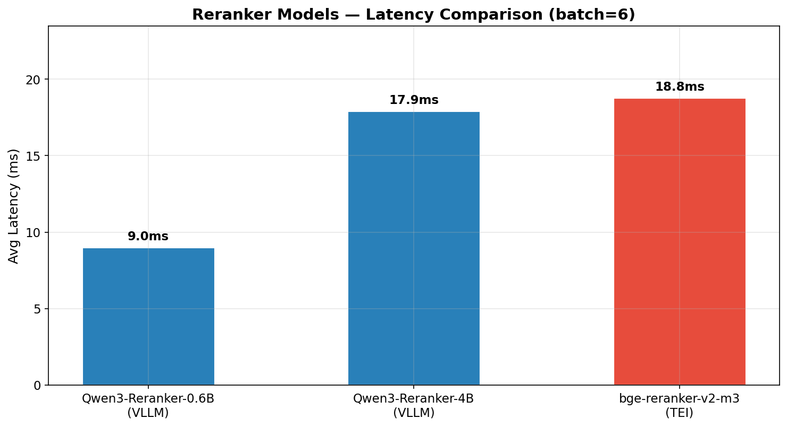

| 模型 | 框架 | Batch | Avg Latency (ms) | P95 Latency (ms) |
|------|------|:---:|:---:|:---:|
| Qwen3-Reranker-0.6B | VLLM | 6 | 9.02 | 9.88 |
| Qwen3-Reranker-4B | VLLM | 6 | 17.93 | 19.38 |
| bge-reranker-v2-m3 | TEI | 6 | 18.78 | 32.39 |

> 注意: Reranker 测试仅使用 batch=6（6 篇文档），不同框架间不可直接对比（模型不同）。

---

## 关键发现

- **Qwen3-Embedding-0.6B**: vLLM 单请求延迟比 TEI 快 **2.2x** (short text, batch=1)
- **Qwen3-Embedding-0.6B**: vLLM 大批次长文本 (batch=32, long) 比 TEI 快 **2.8x**
- **Qwen3-Embedding-4B**: vLLM 单请求延迟比 TEI 快 **1.7x** (short text, batch=1)
- **Qwen3-Embedding-4B**: vLLM 大批次长文本 (batch=32, long) 比 TEI 快 **6.9x**
- **bge-m3 (TEI)** 单请求延迟仅 **7.3ms**，是所有 Embedding 模型中最快的
- **4B vs 0.6B**: Qwen3-Embedding-4B 单请求延迟是 0.6B 的 **1.6x** (TEI, batch=1)
- **Reranker 最快**: Qwen3-Reranker-0.6B (VLLM) — 9.0ms/batch
- **并发高吞吐**: TEI 在高并发 (cc=32) 短文本 QPS (1196) 优于 vLLM (924)
- **长文本并发**: vLLM 在 cc=32 long 文本 QPS (880) 是 TEI (324) 的 2.7x

## 技术选型建议

### Embedding 服务

| 场景 | 推荐方案 | 理由 |
|------|----------|------|
| 低延迟单请求 | vLLM | 单请求延迟显著低于 TEI，P95 尾部延迟也更优 |
| 高并发短文本 | TEI | 高并发下 QPS 更高，短文本延迟劣化更小 |
| 高并发长文本 | vLLM | 长文本高并发下 QPS 显著优于 TEI，延迟劣化更小 |
| 高吞吐批量处理 | vLLM | 大批次场景下吞吐量优势更大，加速比随 batch 增大而增加 |
| 简单部署/Docker 环境 | TEI | 开箱即用，无需 Python 环境，Docker 一键部署 |
| 混合推理 (生成+Embedding) | vLLM | 同一框架支持生成和 Embedding，减少运维复杂度 |

### Reranker 服务

| 场景 | 推荐方案 | 理由 |
|------|----------|------|
| 追求低延迟 | Qwen3-Reranker-0.6B (vLLM) | 9ms/batch，延迟最低 |
| 追求精度 | Qwen3-Reranker-4B (vLLM) | 18ms/batch，更大模型精度更高 |
| TEI 生态兼容 | bge-reranker-v2-m3 (TEI) | TEI 原生支持，延迟可接受 (19ms) |

---

## 技术选型

| 组件 | 选择 | 理由 |
|------|------|------|
| 包管理 | uv | 项目约定 |
| Embedding/Reranker (本地) | transformers | HuggingFace 官方库，基线参考 |
| Embedding/Reranker (本地) | vllm | 高吞吐推理框架，`runner="pooling"` 模式 |
| Embedding/Reranker (服务) | TEI (Docker) | HuggingFace 官方 embedding 专用服务 |
| HTTP 客户端 | aiohttp | 异步，灵活控制并发 |
| 可视化 | matplotlib | 轻量，无额外重依赖 |
| GPU 监控 | nvidia-smi | 无需额外库 |

---

*完整测试数据明细见 [results/report.md](results/report.md)*
